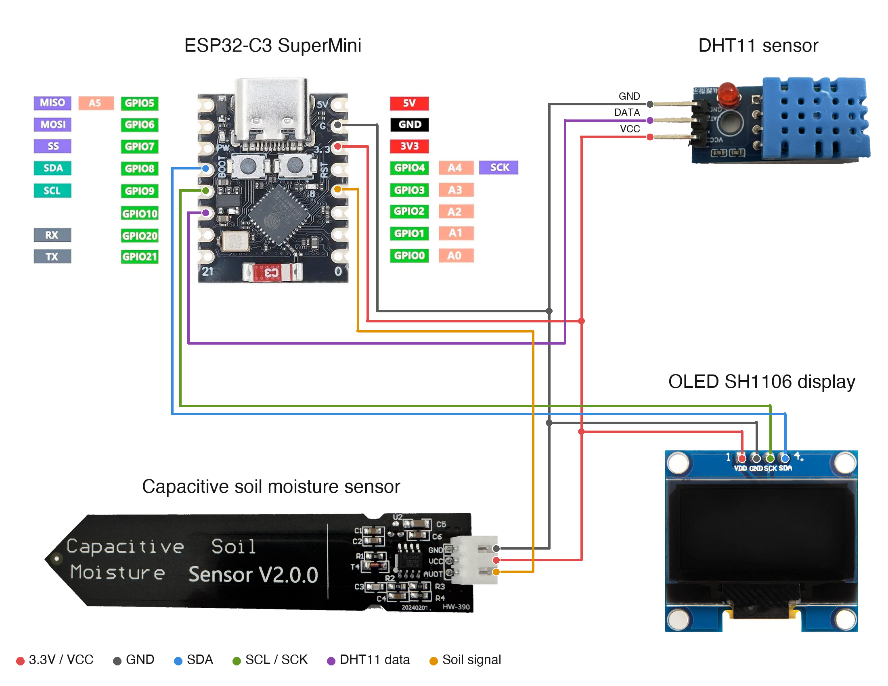

# ElTech-Online ESP32-C3 Plant Monitor

> **Status: prototype.** The code compiles for the ESP32-C3 but has not yet been confirmed on real hardware. Pin choices, the default calibration values and the self-test ranges may still change.

A beginner-friendly **learning kit**: build a plant monitor from an **ESP32-C3 SuperMini**, a **capacitive soil moisture sensor**, a **DHT11** temperature/humidity sensor and a **1.3" OLED SH1106** display. It shows how wet the soil is as a percentage, tells you when the plant needs water, and hosts its own WiFi dashboard. No prior electronics or coding experience needed.

Designed, coded and documented by ElTech-Online in Callander, Scotland — the kit design, firmware, WiFi dashboard and this guide are our own work.


## What you'll learn

The three parts each talk to the ESP32 in a different way, so one small project covers the three most common kinds of sensor connection:

- **Analog** — the soil sensor gives a voltage that the ESP32 measures with its analog-to-digital converter (ADC)
- **One-wire digital** — the DHT11 sends its readings as a train of timed pulses on a single wire
- **I2C** — the OLED display shares a two-wire bus (SDA/SCL) and answers to its own address

Along the way you'll also pick up:

- **Calibrating a sensor** — turning a raw voltage into a meaningful 0–100 % using two reference points
- **Saving settings in flash memory** — so the calibration survives a power cut
- **Flashing Arduino firmware** — installing a board package, picking the right settings and uploading code
- **Hosting your own WiFi dashboard** — the board becomes its own Access Point and serves a live-updating webpage, with no router or internet needed
- **Verifying your own work** — the firmware runs a pass/fail self-test on boot

The code is written to be read: every section is commented in plain language, and [How the code works](#how-the-code-works) walks through it.

## How the soil moisture sensor works

The sensor is a **capacitive** type. The long flat end is a capacitor made of two copper areas under a protective coating. Water changes how much electrical charge that capacitor can hold: the wetter the soil around it, the higher its capacitance.

A small timer chip on the sensor turns that into a simple voltage on the signal pin:

- **Dry** (in air, or dry soil) → **higher** voltage
- **Wet** (in water, or wet soil) → **lower** voltage

The ESP32 measures that voltage and converts it to a percentage. Because no bare metal touches the soil, this type of sensor doesn't corrode the way the cheaper two-prong "resistive" sensors do.

Two things to know:

- **It measures relative wetness, not a scientific water content.** 0 % means "as dry as when you calibrated in air" and 100 % means "as wet as standing in water". Different soils read a little differently, which is why you calibrate.
- **Only the flat end goes in the soil.** The components and connector at the cable end must stay dry. The edges of the board are not sealed, so don't leave the sensor standing in water.

> **Tip for long-term use:** if the sensor is going to live in a plant pot for weeks, seal it first. Brush a thin coat of clear varnish (clear nail varnish works well) along the cut edges of the board and over the flat end, and let it dry fully. This stops moisture creeping into the board, which otherwise makes the readings drift over time. Keep the varnish off the connector, and calibrate the sensor after it has dried, not before.

## What it does

- Reads soil moisture (analog), air temperature and humidity (DHT11)
- Shows a boot splash, then a live readout: soil moisture as the big headline number, a `DRY` / `OK` / `WET` status, and air temperature and humidity underneath
- Starts its own WiFi network and serves a dashboard page with the same readings, the calibration buttons and the self-test results
- Mirrors every reading to Serial (115200 baud)
- Runs a self-test on boot:

  ```
  --- Self-test ---
  OLED (SH1106): OK
  DHT11:         OK (21.4 C, 48 %)
  Soil sensor:   OK (2280 mV)
  WiFi AP:       OK
  RESULT:        PASS
  ```

  Each line reads `OK`, `NOT FOUND` (check the wiring) or `BAD READING` (the part answers but its data is wrong). If anything fails, the OLED also shows a **SELF-TEST FAILED** screen listing what failed.

There are **two sketches** in this repo:

| Sketch | What it is |
|---|---|
| `soil_sensor_test/` | The smallest possible start: reads the soil sensor once a second and prints the voltage. About 20 lines of code. Begin here. |
| `plant_monitor/` | The full project: soil sensor + DHT11 + OLED + WiFi dashboard + calibration. |

## Hardware

| Component | Notes |
|---|---|
| ESP32-C3 SuperMini (or any ESP32-C3 dev board) | |
| Capacitive soil moisture sensor (v2.0 type, 3 pins: GND / VCC / AOUT) | Analog output. The signal pin is printed `AUOT` on some boards. |
| DHT11 module (3 pins: GND / DATA / VCC) | A module with the pull-up resistor already on the board |
| 1.3" OLED, SH1106 driver, 128×64, I2C | Address `0x3C` (try `0x3D` if blank) |
| Breadboard + jumper wires | 10 wires: 4 for the OLED, 3 for the DHT11, 3 for the soil sensor |

## Wiring

| Signal | ESP32-C3 | OLED | DHT11 module | Soil sensor |
|---|---|---|---|---|
| 3.3V | 3V3 | VDD | VCC | VCC |
| GND | GND | GND | GND | GND |
| I2C data | GPIO 8 | SDA | | |
| I2C clock | GPIO 9 | SCK | | |
| DHT11 data | GPIO 10 | | DATA | |
| Soil signal | GPIO 3 | | | AOUT |



All three parts share the same 3V3 and GND: use the breadboard's power rails. **Always follow the labels printed on your own modules** — the pin order differs between manufacturers.

Why those pins:

- **GPIO 3** can read analog voltages. On the ESP32-C3 only GPIO 0–4 can do that while WiFi is running.
- **GPIO 10** is a plain digital pin. Avoid GPIO 2, 8 and 9 for extra parts: the board also uses them to decide how to start up.

## Setup (Arduino IDE)

**Before you start:** download and install the free **Arduino IDE 2** from [arduino.cc/en/software](https://www.arduino.cc/en/software). The ESP32-C3 connects over its own USB-C port, so there's no separate USB driver to install. Use a USB cable that carries data: some cheap cables only charge, and then the board never shows up.

1. **Add the ESP32 board index**: `File > Preferences` → Additional Boards Manager URLs:
   ```
   https://raw.githubusercontent.com/espressif/arduino-esp32/gh-pages/package_esp32_index.json
   ```
2. **Install the board package**: `Tools > Board > Boards Manager`, search "esp32", install **esp32 by Espressif Systems**.
3. **Select the board**: `Tools > Board > esp32 > ESP32C3 Dev Module`.
4. **Tools menu settings**:

   | Setting | Value |
   |---|---|
   | Board | ESP32C3 Dev Module |
   | USB CDC On Boot | Enabled |
   | CPU Frequency | 160MHz |
   | Erase All Flash Before Sketch Upload | Disabled |
   | Flash Size | 4MB (32Mb) |
   | Partition Scheme | Default 4MB with spiffs (1.2MB APP/1.5MB SPIFFS) |
   | Upload Speed | 921600 |

5. **Install libraries** via `Sketch > Include Library > Manage Libraries`:
   - DHT sensor library (by Adafruit)
   - Adafruit SH110X
   - Adafruit GFX Library

   If Library Manager asks to install dependencies (Adafruit BusIO, Adafruit Unified Sensor), click **Install all**.

   **Tested with** these versions (compile-tested; hardware confirmation pending):

   | Package | Version |
   |---|---|
   | esp32 by Espressif Systems (board package) | 3.3.11 |
   | DHT sensor library | 1.4.7 |
   | Adafruit SH110X | 2.1.15 |
   | Adafruit GFX Library | 1.12.6 |
   | Adafruit BusIO | 1.17.4 |
   | Adafruit Unified Sensor | 1.1.15 |

6. Open `soil_sensor_test/soil_sensor_test.ino` first, upload it, and check the readings in Serial Monitor. Then open `plant_monitor/plant_monitor.ino` and upload that.

### Opening the Serial Monitor

1. Open it with `Tools > Serial Monitor`.
2. Set the speed drop-down to **115200 baud**. At the wrong speed, you'll see garbled characters or nothing at all.
3. The self-test only runs once, right after the board starts. If you opened the Serial Monitor too late, press the board's **RST** (reset) button to run it again.

**Seeing nothing at all?** Check that `Tools > USB CDC On Boot` is set to **Enabled**.

### If the upload fails

If the upload stops with an error like `Failed to connect`, put the board into download mode by hand:

1. Hold down the **BOOT** button on the board.
2. While holding it, press and release **RST** (or unplug and re-plug the USB cable).
3. Release **BOOT**, choose the port under `Tools > Port` and click **Upload** again.
4. When the upload finishes, press **RST** once to start the new code.

## WiFi dashboard

1. Upload `plant_monitor`. Every board creates its **own** network name (e.g. `ElTech-PM-A3F2`) and its **own** random 8-character password, saved in the board's flash memory.
2. The OLED and Serial Monitor show the network name, password and the address `http://192.168.4.1`.
3. On your phone or laptop, connect to that WiFi network, then open that address in a browser.
4. The page shows soil moisture, air temperature and humidity, and updates itself every 2 seconds.

This is a standalone Access Point, not connected to your home WiFi or the internet. Range is roughly a typical room.

## Calibrating the soil sensor

Every sensor gives slightly different voltages, so the firmware needs to learn two points for yours. Do it once; it's saved in flash memory and survives power-off and re-uploads.

1. Open the dashboard page.
2. Hold the sensor in the air, clean and dry. Press **Set dry**. That reading becomes 0 %.
3. Stand the flat end in a glass of water, keeping the cable end out. Press **Set wet**. That reading becomes 100 %.

The page shows the saved points and the live sensor voltage, so you can see what the calibration is doing. **Reset** goes back to the built-in defaults.

No phone to hand? In Serial Monitor, type `d` (set dry), `w` (set wet) or `r` (reset) and press Enter.

If the dry and wet points end up too close together (less than 300 mV apart), the firmware treats the calibration as a mistake and shows the raw voltage instead of a percentage until you set them again.

## How the code works

Open `plant_monitor/plant_monitor.ino` alongside this section. The file starts with a short guide to its own layout. Every Arduino sketch has two main functions: `setup()` runs once when the board starts, and `loop()` then runs over and over, forever.

1. **Settings at the top.** Pin numbers, the default calibration and the `DRY`/`WET` thresholds are all named values you can change in one place.
2. **Reading the soil sensor.** `readSoilMillivolts()` measures the pin with `analogReadMilliVolts()`. One reading is a little noisy, so it takes 16 and averages them.
3. **Turning voltage into a percentage.** `soilPercent()` scales the reading between the dry point (0 %) and the wet point (100 %). The comment above it has a worked example.
4. **Saving the calibration.** `calibrate()` stores the current reading with the ESP32's `Preferences` library, which keeps values in flash memory when the power is off. `loadCalibration()` reads them back at start-up.
5. **Reading the DHT11.** `dht.readTemperature()` and `dht.readHumidity()` do the pulse timing for you. The sensor occasionally misses a reading, so the code keeps the last good values and only reports a problem after five misses in a row.
6. **The web server.** `/` sends the page (stored in `page_template.h`), `/data` sends the current readings as JSON, and `/calibrate` saves a calibration point. JavaScript in the page fetches `/data` every 2 seconds.
7. **No `delay()` in `loop()`.** The web server has to keep answering browsers, so `loop()` checks the clock with `millis()` and only reads the sensors when 2 seconds have passed.
8. **Drawing on the OLED.** `drawDataScreen()` builds the picture in memory, and `display.display()` sends it to the screen in one go.
9. **The self-test.** `runSelfTest()` takes one reading from each part and checks that it's believable.

## Try this next

Small changes to try yourself, roughly easiest first. Change one thing, upload, and check the result before moving on.

1. **Change when it says DRY.** Edit `DRY_BELOW_PCT` and `WET_ABOVE_PCT` near the top to suit your plant.
2. **Change how often it updates.** Change the `2000` in `millis() - lastRead >= 2000`.
3. **Show °F instead of °C.** Convert before displaying: `g_temperature * 9.0 / 5.0 + 32.0`.
4. **Track the driest reading.** Add a variable above `setup()` that remembers the lowest percentage seen, and print it to Serial.
5. **Add a "days since watered" counter.** Record `millis()` whenever the reading jumps up by more than 20 %, and show the time since then.
6. **Add a warning light.** Connect an LED (with a resistor) to a spare pin and switch it on when the status is `DRY`.
7. **Add a new value to the web dashboard.** Add a field to the JSON in `handleData()`, copy a `<div class="card">` block in `page_template.h`, and set it in `refresh()`.

## Using your own logo instead

`plant_monitor/logo_bitmap.h` contains the ElTech-Online shop logo as a 48×32 monochrome bitmap. To swap in your own:

1. Convert your logo to a 1-bit bitmap sized to fit within 48×32 (e.g. with [image2cpp](https://javl.github.io/image2cpp/))
2. Replace the array in `logo_bitmap.h`, keeping the `LOGO_WIDTH`/`LOGO_HEIGHT` defines in sync

Or just delete the `drawBitmap(...)` line in `setup()` and keep the text-only splash.

## License

The code, documentation and wiring diagram are MIT-licensed — see [LICENSE](LICENSE). Use them, modify them, build your own kit with them.

**The ElTech-Online name and logo are not covered by the MIT license.** The logo files (`logo.png` and the bitmap in `logo_bitmap.h`) are © ElTech-Online, all rights reserved. If you build or sell your own version, swap in your own logo and don't present it as an ElTech-Online product.
